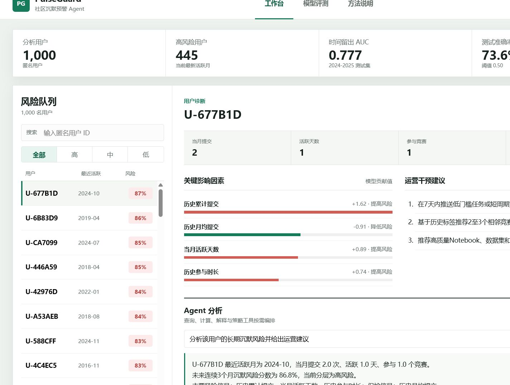

# PulseGuard | Kaggle社区用户沉默预警Agent

PulseGuard是一个面向Kaggle社区运营人员的可解释用户沉默预警原型。项目把公开行为数据、风险模型和Agent工具编排整合到同一工作台，用于筛选高风险用户、解释风险因素并生成可复核的运营建议。



## 核心能力

- 风险队列：按照高、中、低风险筛选匿名用户。
- 用户诊断：展示近期行为、风险分数和关键影响因素。
- Agent工具链：依次调用画像查询、风险计算、因素解释和策略生成工具。
- 人工复核：保留工具调用轨迹，不把相关性描述为因果关系。

## 数据与评测

- 数据来源：Meta Kaggle公开行为数据。
- 分析面板：62,471条用户月度记录、1,000名匿名用户。
- 产品标签：当前月有活动，未来连续3个月无提交、无活跃天数且无参赛记录。
- 时间留出测试：2024-01至2025-12，共474条观测。
- 测试结果：ROC AUC 0.777、准确率73.6%、召回率82.3%。

以上均为离线评测结果，不代表真实上线后的业务提升。

## 本地运行

```powershell
python app.py --port 8765
```

打开 `http://127.0.0.1:8765`。不要直接打开 `web/index.html`，静态文件模式无法调用Agent接口。

## 公网部署

项目已提供 `render.yaml`：

1. 将仓库连接到Render。
2. 选择 `New` > `Blueprint`。
3. Render读取配置并创建Python Web Service。
4. 健康检查地址为 `/api/summary`。

## 作品材料

- `PulseGuard_AI_Agent_产品作品集.pptx`：8页产品作品集。
- `docs/PulseGuard_AI_Agent_PRD.docx`：产品需求文档。
- `docs/agent_workflow.mmd`：Agent工作流过程文件。
- `artifacts/evaluation.json`：模型评测结果。
- `artifacts/evaluation_cases.csv`：测试集预测明细。

## 复现模型产物

原始Meta Kaggle数据未包含在仓库中。准备用户月度面板后运行：

```powershell
python build_artifacts.py --panel path/to/risk_panel_reproduced.pkl
```
